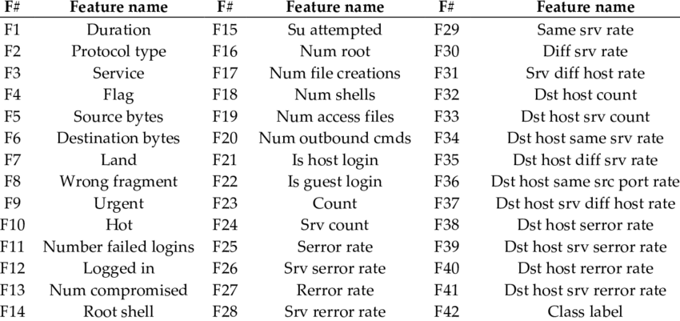

# Network Intrusion Detection with SVM on NSL-KDD Dataset

This project is focused on a Python-based machine learning project which aims to detect network intrusions using the NSL-KDD dataset, a refined version of the original KDD dataset tailored for network intrusion detection tasks. The project showcases the application of Support Vector Machine (SVM) classifiers to identify intrusive activities within network traffic.

## Table of Contents

-   [Overview](#overview)
-   [Features](#features)
-   [Dependencies](#dependencies)
-   [Dataset](#dataset)
-   [Results](#results)
-   [Usage](#usage)

## Project Overview

We aim to classify network connections into normal traffic and various types of attacks using SVM classifiers. The project demonstrates thorough data preprocessing, model training with SVMs using various hyperparameters, and a comprehensive evaluation of model performance.

### Features

-   **NSL-KDD Dataset**: Utilizes the NSL-KDD dataset, which mitigates problems present in earlier datasets by avoiding duplicate records and providing a more balanced representation of network traffic.
-   **Data Preprocessing**: Employs a custom Preprocessor class within a sklearn pipeline to apply scaling to numerical features and one-hot encoding to categorical features.
-   **Model Training and Optimization**: Trains SVM models with distinct kernels and regularization settings, evaluating them to determine the most effective model parameters.
-   **Performance Metrics**: Assesses models using metrics such as accuracy, with visualization tools to better understand model predictions.
-   **Visualization**: Uses matplotlib to create visual representations of model performance, including confusion matrices.

## Dependencies

-   Python 
-   scikit-learn
-   pandas
-   matplotlib
-   numpy

## Dataset

The NSL-KDD dataset is a benchmark dataset for network intrusion detection systems, containing a mix of 41 different features, with labeled data indicating normal or attack traffic add we got the dataset columns name from this site: <a href="https://www.researchgate.net/figure/List-of-features-of-NSL-KDD-dataset_tbl1_325709588">DataSet</a>

  

## Results

The SVM models are tested, with training accuracy reaching as high as 99.97% and test accuracy ranging from approximately 81% to 85%.

  

## Usage

1. **Data Preparation**: Load the NSL-KDD dataset and preprocess it using the provided Preprocessor class, which normalizes and encodes the data for the learning algorithm.
2. **Model Training**: Train several SVM models with various kernels and regularization parameters. Record their performance metrics to compare and select the best-performing model.
3. **Evaluation**: Utilize confusion matrices and accuracy metrics to evaluate the models' performance on both the training and test datasets.
4. **Visualization**: Generate and analyze confusion matrices to visualize true positives, false positives, true negatives, and false negatives. Plot pie charts for an insightful distribution of categorical features within the dataset.
